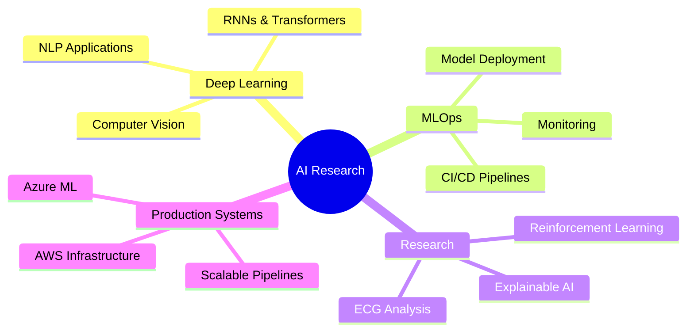

<div align="center">

# 👋 Hey, I'm Hemanth

### AI Researcher | AI/ML Engineer | Startup Founder

[](https://linkedin.com/in/yourprofile)
[](mailto:your.email@example.com)
[](https://yourportfolio.com)

</div>

---

## 🎯 About Me

```python
class AIResearcher:
    def __init__(self):
        self.name = "Hemanth Vamsi Krishna Devadula"
        self.role = "AI Researcher & Deep Learning Engineer"
        self.education = {
            "degree": "MS in Artificial Intelligence",
            "university": "University of Central Missouri",
            "gpa": "3.85/4.0",
            "graduation": "May 2026"
        }
        self.experience = "3+ years in AI/ML & Data Engineering"
        self.current_focus = ["Deep Learning", "NLP", "Computer Vision", "MLOps"]
    
    def say_hi(self):
        print("Building AI systems that disrupt industries, not just optimize them.")

me = AIResearcher()
me.say_hi()
```

🎓 **MS in Artificial Intelligence** @ University of Central Missouri (GPA: 3.75/4.0)  
💼 **Graduate Student Employee** | Former **Systems Engineer @ TCS** (3+ years)  
🚀 **2× Founder**: AgTech startup (AI hydroponics) & Manufacturing AI (Hive Quality Network)  
📖 **Conference Speaker**: ATMAE, ASQ, IFMA (National & International)  
🏋️ **Fitness Enthusiast** focused on body recomposition & physical resilience

---

## 🔥 Featured Projects

<table>
<tr>
<td width="50%">

### 🧠 [RNN & Transformer from Scratch](https://github.com/yourusername/rnn-transformer-from-scratch)
Implementation of LSTM, GRU, and **Multi-Head Self-Attention** (foundation of GPT/BERT) from scratch using NumPy.

**Tech:** `Python` `NumPy` `NLP` `Transformers` `BPTT`

**Highlights:**
- 3 RNN variants (VanillaRNN, LSTM, GRU)
- Attention mechanisms powering modern LLMs
- Text generation & sentiment analysis
- 1,833 lines of production code

</td>
<td width="50%">

### 🖼️ [CNN Architecture from Scratch](https://github.com/yourusername/cnn-architecture-from-scratch)
LeNet-5 and MiniVGG architectures with **im2col optimization** for efficient convolution operations.

**Tech:** `Python` `NumPy` `Computer Vision` `CNNs`

**Highlights:**
- Conv2D with im2col algorithm
- Batch normalization for CNNs
- CIFAR-10 classification (80% accuracy)
- 1,240 lines of optimized code

</td>
</tr>

<tr>
<td width="50%">

### 🧮 [Neural Network from Scratch](https://github.com/yourusername/neural-network-from-scratch)
Complete neural network with **manual backpropagation** and gradient verification.

**Tech:** `Python` `NumPy` `Deep Learning`

**Highlights:**
- Dense layers, ReLU, Sigmoid, Softmax
- Gradient checking for correctness
- MNIST digit classification
- SGD optimizer with momentum

</td>
<td width="50%">

### ❤️ **AI for Healthcare**
Robust ECG R-peak detection & **imbalanced arrhythmia classification** using advanced ML techniques.

**Tech:** `PyTorch` `Scikit-Learn` `TabNet`

**Highlights:**
- ECG signal processing
- Imbalanced data handling
- Clinical-grade accuracy
- Real-time inference

</td>
</tr>

<tr>
<td width="50%">

### 📊 **Charter** (In Progress)
Open-source AI-powered app for **natural-language-driven data visualization**.

**Tech:** `React` `Python` `FastAPI` `LLMs`

**Highlights:**
- Natural language → Charts
- Multiple visualization types
- Interactive dashboards
- RAG-based chart generation

</td>
<td width="50%">

### ✈️ **AI in Air Traffic Control**
Reinforcement learning for **runway conflict detection & resolution**.

**Tech:** `Python` `RL` `Simulation`

**Highlights:**
- RL-based decision making
- Real-time conflict resolution
- Safety-critical AI system
- Simulation environment

</td>
</tr>
</table>

---

## 💻 Tech Stack

<div align="center">

### Languages & Frameworks


### AI/ML & Deep Learning


### Cloud & Data


</div>

---

## 📊 GitHub Stats

<div align="center">


</div>

---

## 🚀 Current Focus



---

## 🏆 Achievements & Recognition

🌍 **IFMA SFP Certification Scholar**  
📝 **Published Researcher** at ATMAE, ASQ, and Technical Conferences  
🎤 **Conference Speaker** representing UCM nationally & internationally  
👔 **Leadership Roles**: ASQ UCM Chapter, Alumni Ambassadors Club  
🚀 **2× Startup Founder** (AgTech & Manufacturing AI)  

---

## 🎯 Entrepreneurial Journey

### 2017: Electric Wheelchair Innovation
Built a **detachable electric single-wheel attachment** for wheelchairs
- Top speed: 25 km/h
- Portable and easy to install
- Enhanced mobility for users

### 2020: AgTech Startup
Founded **AI-driven hydroponics & aquaponics agriculture startup**
- Vertical farming solutions
- AI-based crop optimization
- Sustainable food production

### 2023: Hive Quality Network
Co-founded **collaborative manufacturing AI platform**
- Multi-company defect detection
- Distributed quality control
- AI-powered pattern recognition

---

## 📈 Research Interests

- 🔬 **Explainable AI (XAI)** - Making AI decisions interpretable
- 🤖 **Reinforcement Learning** - Autonomous decision-making systems
- ❤️ **Healthcare AI** - ECG analysis, medical diagnostics
- 🏭 **Industrial AI** - Supply chain optimization, quality control
- 🌐 **IoT & Edge AI** - Device fingerprinting, edge deployment
- 📊 **MLOps** - Production ML systems, monitoring, scaling

---

## 💡 Philosophy

> _"I don't just build AI models — I build AI systems that challenge industries, empower people, and inspire the future."_

- 🎯 **Impact over Optimization**: Creating disruptive AI solutions, not incremental improvements
- 🔧 **First Principles Thinking**: Building from scratch to understand deeply
- 🌍 **Real-World Applications**: Research that solves actual problems
- 🚀 **Continuous Learning**: Always exploring cutting-edge techniques
- 💪 **Resilience**: Applying fitness discipline to technical challenges

---

## 📫 Let's Connect!

<div align="center">

**Open to collaborations, research opportunities, and interesting conversations about AI!**

[](https://linkedin.com/in/yourprofile)
[](mailto:your.email@example.com)
[](https://twitter.com/yourhandle)
[](https://yourportfolio.com)

</div>

---

<div align="center">

### ⭐ Don't forget to star my repositories if you find them useful!


</div>
